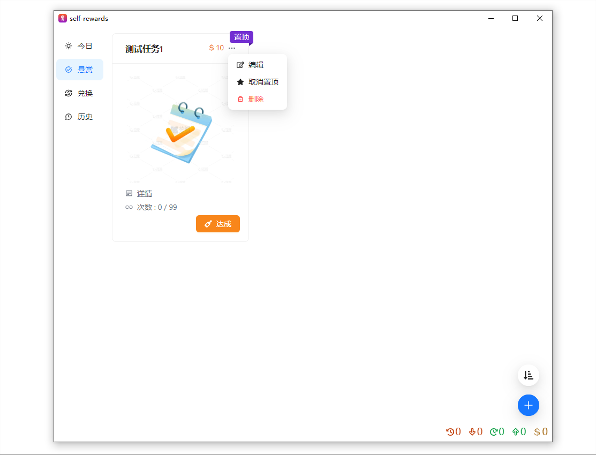
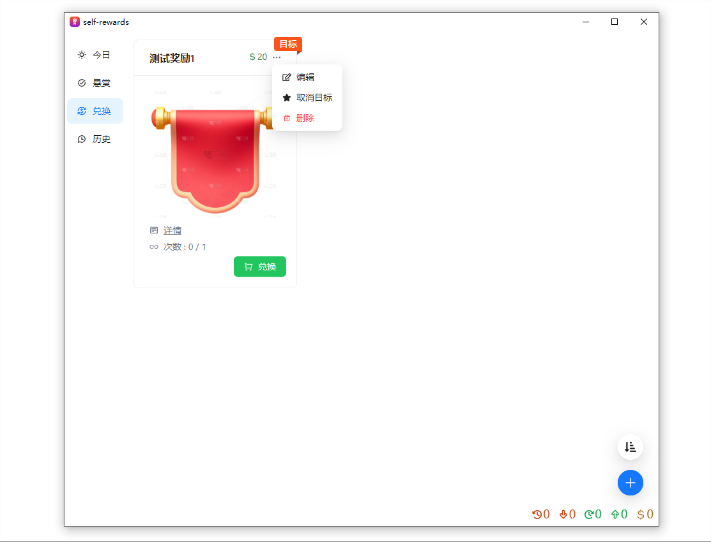

# 🎈 简介

  
  

完成任务获取点数、消耗点数兑换奖励。让”努力“和”奋斗“可视化，提供正反馈。

# 🛠️ 技术栈

- 编程语言：typescript + rust
- 前端框架：React
- 构建工具：vite
- css框架：tailwindcss
- 组件库：antd
- 代码格式化工具：prettier
- 桌面应用框架：tauri

# 📆 TODO
- [ ] 添加单元测试模块；
- [ ] 添加检索功能；
- [ ] 允许拖动排序；
- [ ] 支持快捷键；